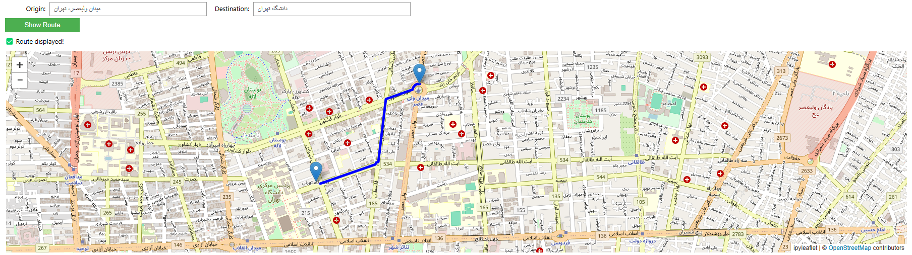

# 🗺️ TehranNavigator

A Python-based interactive route planner for **Tehran, Iran**, using real street network data. Users can input origin and destination addresses and visualize the shortest path between them on an interactive map.

---

## 🌟 Features

- **Interactive Widgets**: Input origin and destination easily.
- **Geocoding**: Converts addresses to coordinates using OpenCage Geocoder.
- **Street Network Data**: Fetches real road data of Tehran via **OSMnx**.
- **Shortest Path Calculation**: Uses **NetworkX** to compute the optimal route.
- **Visualization**: Displays the route interactively using **ipyleaflet**.

---

## 🚀 Getting Started

### Prerequisites

- Python 3.7+
- Jupyter Notebook or JupyterLab

### 📦 Installation

Install required packages:

```bash
pip install osmnx networkx ipyleaflet opencage ipywidgets
```

---

## 📷 Preview

> _Example of route visualization 

 <!-- Optional image -->

---


## ▶️ Usage

1. Open the Jupyter Notebook [`main.ipynb`](main.ipynb).
2. Enter your origin and destination in the provided fields.
3. Click **Show Route** to visualize the shortest path on the map.

---

## 🧠 How It Works

1. **Geocode Addresses**: Converts user input into latitude/longitude.
2. **Fetch Graph Data**: Downloads the street network of Tehran.
3. **Find Nodes**: Locates nearest nodes on the graph to start/end points.
4. **Compute Path**: Calculates the shortest path using Dijkstra’s algorithm.
5. **Visualize**: Draws the path on an interactive map with markers.

---

## 🧰 Technologies Used

| Tool              | Purpose                          |
|-------------------|----------------------------------|
| **OSMnx**         | Fetching OpenStreetMap data      |
| **NetworkX**      | Graph analysis and pathfinding   |
| **ipyleaflet**    | Interactive mapping in Jupyter   |
| **OpenCage Geocoder** | Geocoding addresses          |
| **ipywidgets**    | UI controls in notebooks         |

---

## 📄 License

This project is licensed under the MIT License.

---

## 👨‍💻 Author

**Your Name**  
[GitHub Profile](https://github.com/Amir-Hossein-shamsi)  
📧 shamsiamirhossein1@gmail.com

---

## ⭐️ Show Your Support

If you like this project, give it a ⭐️

